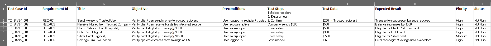

# Banking Transactions & Card Eligibility Test Suite

## About This Test Suite
This repository contains a structured test suite for a banking system.  
It demonstrates the application of **Boundary Value Analysis (BVA)** and **Equivalence Partitioning (EP)** to financial rules such as transaction flows, card eligibility thresholds, and savings limits.

The focus is on ensuring that:
- Clients can send money to trusted recipients and receive money from trusted companies.  
- Card eligibility is correctly determined based on monthly salary thresholds:  
  - Black Platinum → ≥ $5000  
  - Gold → ≥ $3000  
  - Silver → ≥ $1500  
- Savings limits are enforced (maximum $150).  
- Invalid or unauthorized transactions are rejected.

---

## Files
- **Banking-TestSuite.xlsx** → Includes a professional cover page and formatted test suite.  
- **Banking-TestSuite.csv** → Lightweight version for quick preview and tool import.  

---

## Test Case Categories
- **Transactions** → Sending and receiving money with trusted parties.  
- **Card Eligibility** → Salary thresholds for Black Platinum, Gold, and Silver cards.  
- **Savings Validation** → Enforcing maximum savings limits.  
- **Boundary Testing** → Salary and savings edge cases.  

---

## Notes
- Status values are set to *Not Run* as this is a sample design portfolio.  
- In a real project, statuses would be updated during execution in tools like **TestRail** or **Jira Zephyr**.  
- Both `.xlsx` and `.csv` formats are provided:  
  - Excel shows professional formatting and cover page.  
  - CSV allows quick preview and import into test management tools.  

---

